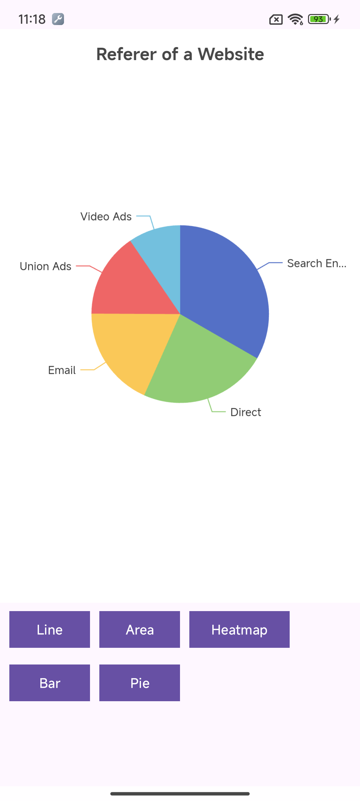

# Introduce

In order to make [Echart](https://echarts.apache.org/) easier to use in Android, this project simply encapsulates it.



# Quick start

**Add dependencies**
settings.gradle.kts

```kotlin
dependencyResolutionManagement {
    repositoriesMode.set(RepositoriesMode.FAIL_ON_PROJECT_REPOS)
    repositories {
        ...
        maven(url = "https://jitpack.io")
    }
}
```

build.gradle.kts

```kotlin
dependencies {
    implementation("com.github.TTTUUUIII:AndroidEcharts:1.0.1-alpha")
    implementation("com.google.code.gson:gson:2.11.0")
    ...
}
```

**Add figure to layout**
```xml
<?xml version="1.0" encoding="utf-8"?>
<androidx.constraintlayout.widget.ConstraintLayout xmlns:android="http://schemas.android.com/apk/res/android"
    xmlns:app="http://schemas.android.com/apk/res-auto"
    xmlns:tools="http://schemas.android.com/tools"
    android:id="@+id/main"
    android:layout_width="match_parent"
    android:layout_height="match_parent">
    ...
    <cn.touchair.androidecharts.FigureView
        android:id="@+id/figure_view"
        android:layout_width="match_parent"
        android:layout_height="0dp"
        app:layout_constraintBottom_toTopOf="@+id/linearLayout"
        app:layout_constraintEnd_toEndOf="parent"
        app:layout_constraintStart_toStartOf="parent"
        app:layout_constraintTop_toTopOf="parent" />
    ...
</androidx.constraintlayout.widget.ConstraintLayout>
```

**Draw chart**
```kotlin
private fun drawLineChart() {
    /*Impl line option*/
    val line = object : EChartOption {
        private val xAxis = Axis(
            type = Axis.TYPE_CATEGORY,
            data = listOf("Mon", "Tue", "Wed", "Thu", "Fri", "Sat", "Sun")
        )
        private val yAxis = Axis<Any>(type = Axis.TYPE_VALUE)
        private val series = Series(
            data = listOf(150, 230, 224, 218, 135, 147, 260),
            type = SeriesType.LINE
        )
    }
    /*draw line chart*/
    binding.figureView.draw(line)
}
```